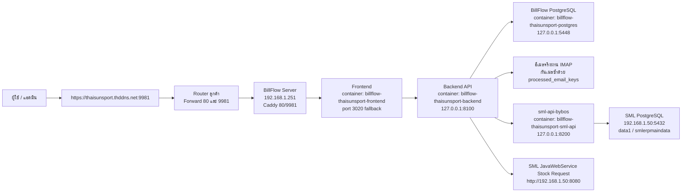
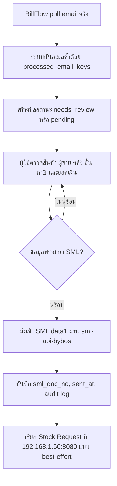

# Workflow ติดตั้งและดูแล BillFlow Server - Thaisunsport

เอกสารนี้ใช้แนบไปกับเครื่อง BillFlow production ของ Thaisunsport เพื่อให้ทีม IT/ผู้ดูแลเห็นภาพรวมว่าเครื่องนี้ทำอะไร อยู่ตรงไหน และต้องตรวจอะไรหลังเสียบเครื่องที่หน้างาน

วันที่จัดทำ: 2026-07-06
เครื่องที่เตรียมไว้: `billflow-thaisunsport-prod`
ผู้ใช้ Linux: `thaisunspot`
รหัสผ่าน: ส่งแยกจากเอกสารนี้ ไม่ควรเขียนติดเครื่อง

## 1. ภาพรวมระบบ

BillFlow เครื่องนี้รับอีเมลจริง, เก็บข้อมูล BillFlow เอง, ให้ผู้ใช้ review บิลซื้อ, แล้วส่งเอกสารเข้า SML ERP ผ่าน SML gateway ที่รันอยู่ในเครื่องเดียวกัน



## 2. IP, URL, Port ที่ต้องจำ

| รายการ | ค่า |
| --- | --- |
| IP BillFlow ที่ลูกค้า | `192.168.1.251` |
| IP BillFlow ตอนเตรียมเครื่อง | `192.168.2.35` |
| URL ใช้งานจริง | `https://thaisunsport.thddns.net:9981` |
| หน้า fallback ใน LAN | `http://192.168.1.251:3020` |
| SML PostgreSQL | `192.168.1.50:5432` |
| SML database | `data1` |
| SML user database | `smlerpmaindata` |
| Stock Request URL | `http://192.168.1.50:8080` |
| ERP SML เดิม | `thaisunsport.thddns.net:9980` |

## 3. Router Port Forward ที่ต้องมี

ตั้งที่ Router ลูกค้า:

| WAN port | Forward ไปที่ | ใช้ทำอะไร |
| ---: | --- | --- |
| `80/tcp` | `192.168.1.251:80` | ให้ Caddy ขอ/ต่ออายุ SSL certificate |
| `9981/tcp` | `192.168.1.251:9981` | URL ใช้งาน BillFlow ผ่าน HTTPS |
| `9980/tcp` | ERP SML เดิม | คงของเดิมไว้ ห้ามทับ |

หมายเหตุ: ผู้ใช้เข้า BillFlow ที่ `https://thaisunsport.thddns.net:9981` เท่านั้น ส่วน port `80` เปิดไว้เพื่อ certificate

## 4. Folder และ Container บน Server

| ส่วน | ที่อยู่ / ชื่อ |
| --- | --- |
| BillFlow folder | `/home/thaisunspot/billflow-thaisunsport` |
| SML gateway folder | `/home/thaisunspot/sml-api-bybos` |
| Docker compose project | `/home/thaisunspot/billflow-thaisunsport/docker-compose.yml` |
| Frontend container | `billflow-thaisunsport-frontend` |
| Backend container | `billflow-thaisunsport-backend` |
| BillFlow DB container | `billflow-thaisunsport-postgres` |
| SML gateway container | `billflow-thaisunsport-sml-api` |
| Reverse proxy container | `billflow-thaisunsport-caddy` |

## 5. สถานะข้อมูลที่เตรียมไว้ก่อนส่งเครื่อง

- ย้ายข้อมูลจาก dev instance มาแล้ว
- เก็บ email dedup ไว้แล้ว จึงไม่ควรดูดอีเมลเก่าซ้ำ
- เก็บ artifact/email attachment ไว้แล้ว
- Reset สถานะส่ง SML แล้ว: บิลเดิมไม่มี `sml_doc_no` และไม่มี `sent_at`
- SML tenant เปลี่ยนจาก `data1_test` เป็น `data1`
- SML DB ชี้ไป LAN ลูกค้าแล้ว: `192.168.1.50:5432`
- Stock Request ชี้ไป LAN ลูกค้าแล้ว: `http://192.168.1.50:8080`
- Shopee API warning ถูกซ่อนแล้วสำหรับ Thaisunsport เพราะ instance นี้เป็น Phase 1 ฝั่งซื้อ

## 6. ขั้นตอนเมื่อเครื่องถึงลูกค้า

1. ตั้ง IP เครื่อง BillFlow เป็น `192.168.1.251`
2. เสียบสาย LAN และไฟ
3. ตรวจว่าเครื่อง SML อยู่ที่ `192.168.1.50`
4. ตั้ง Router port forward ตามหัวข้อ 3
5. เปิด browser ในวง LAN แล้วลองเข้า `http://192.168.1.251:3020`
6. เปิด URL จริง `https://thaisunsport.thddns.net:9981`
7. เข้าเมนู `การเชื่อมต่อระบบ` หรือ `/settings/instance`
8. กดตรวจ SML readiness หรือ refresh หน้า
9. ถ้า SML ready แล้ว ค่อยให้ลูกค้าเริ่ม review และส่ง SML
10. ก่อนเริ่มใช้งานจริง ให้หยุด dev instance ที่ยัง poll email ของ Thaisunsport เพื่อไม่ให้สองเครื่องดูดเมลซ้ำ

## 7. คำสั่งตรวจสุขภาพ

SSH เข้าเครื่อง:

```bash
ssh thaisunspot@192.168.1.251
cd /home/thaisunspot/billflow-thaisunsport
```

ดู container:

```bash
docker compose ps
```

ตรวจ health:

```bash
curl http://127.0.0.1:8100/health
curl http://127.0.0.1:3020/health
curl http://127.0.0.1:8200/health
curl -H "X-Tenant: data1" -H "X-Api-Key: <SML_API_KEY>" http://127.0.0.1:8200/health/ready
```

ค่าที่ควรเห็น:

| คำสั่ง | ผลที่ควรได้ |
| --- | --- |
| backend `/health` | `status=ok`, `database=ok` |
| frontend `/health` | `status=ok` |
| sml-api `/health` | `status=ok` |
| sml-api `/health/ready` | `status=ok`, `database=data1` หลังอยู่ LAN ลูกค้า |

## 8. Restart Service

Restart เฉพาะ frontend:

```bash
docker compose restart frontend
```

Restart เฉพาะ backend:

```bash
docker compose restart backend
```

Restart SML gateway หลังแก้ `.env` ใน `/home/thaisunspot/sml-api-bybos`:

```bash
cd /home/thaisunspot/billflow-thaisunsport
docker compose up -d --force-recreate sml-api
```

Restart ทั้ง stack:

```bash
cd /home/thaisunspot/billflow-thaisunsport
docker compose up -d
```

## 9. ดู Log เวลาเกิดปัญหา

```bash
cd /home/thaisunspot/billflow-thaisunsport
docker compose logs --tail=100 backend
docker compose logs --tail=100 frontend
docker compose logs --tail=100 sml-api
docker compose logs --tail=100 caddy
```

ดู log ต่อเนื่อง:

```bash
docker compose logs -f backend
```

## 10. Backup และไฟล์สำคัญ

| รายการ | Path |
| --- | --- |
| Backup ก่อน reset production | `/home/thaisunspot/deploy-transfer/billflow-thaisunsport-20260706-114241.dump` |
| Backup หลัง reset production | `/home/thaisunspot/billflow-thaisunsport/backups/manual-backups/post-prod-cutover-reset-20260706-114900.dump` |
| BillFlow artifacts | `/home/thaisunspot/billflow-thaisunsport/artifacts` |
| BillFlow env | `/home/thaisunspot/billflow-thaisunsport/.env` |
| SML gateway env | `/home/thaisunspot/sml-api-bybos/.env` |
| SML gateway env backup ก่อนเปลี่ยน LAN DB | `/home/thaisunspot/sml-api-bybos/.env.backup-before-lan-sml-db-20260706-134836` |

## 11. Troubleshooting แบบเร็ว

| อาการ | เช็กอะไร | วิธีแก้เบื้องต้น |
| --- | --- | --- |
| เข้า URL จริงไม่ได้ | Router forward `80` และ `9981`, Caddy log | เช็ก `docker compose logs caddy`, ตรวจ DDNS และ port forward |
| SSL ยังไม่ออก | Public port `80` ยังไม่ถึงเครื่อง | Forward `80 -> 192.168.1.251:80` แล้วรอ Caddy ขอ cert ใหม่ |
| หน้า LAN `3020` เข้าได้ แต่ public เข้าไม่ได้ | ปัญหา router/DDNS/cert | ตรวจ Router, DDNS, Caddy |
| SML readiness ไม่พร้อม | `192.168.1.50:5432`, `data1`, `smlerpmaindata` | เช็ก SML server เปิดไหม, firewall LAN, DB user/pass ใน `/home/thaisunspot/sml-api-bybos/.env` |
| ส่ง SML แล้ว stock request fail | `http://192.168.1.50:8080` | เช็ก SML JavaWebService port 8080 และ endpoint `processstockrequest` |
| อีเมลไม่เข้า | IMAP account, internet, app password | ดูหน้า settings email และ backend log |
| เห็นเมลซ้ำ / dev ยังดูดเมล | dev instance ยัง poll email | หยุด/disable IMAP บน dev instance เดิม |

## 12. สิ่งที่ห้ามลืมก่อนให้ลูกค้าใช้จริง

- [ ] เครื่อง BillFlow เป็น IP `192.168.1.251`
- [ ] Router forward `80 -> 192.168.1.251:80`
- [ ] Router forward `9981 -> 192.168.1.251:9981`
- [ ] ERP SML เดิม `9980` ยังใช้ได้
- [ ] เข้า `https://thaisunsport.thddns.net:9981` ได้
- [ ] หน้า `/settings/instance` ขึ้น SML ready
- [ ] Backend/frontend/sml-api health ok
- [ ] Dev instance เดิมหยุด poll email ของ Thaisunsport แล้ว
- [ ] ทดลองเปิดบิล 1 ใบแบบไม่ส่ง SMLก่อน
- [ ] ทดลองส่ง SML ด้วยบิลที่ลูกค้าเลือกเอง 1 ใบหลังตรวจข้อมูลครบ

## 13. กฎความปลอดภัย

- อย่าเขียนรหัสผ่านติดเอกสารที่แนบกับเครื่อง
- อย่าเปิด backend `8100`, PostgreSQL `5448`, หรือ sml-api `8200` ออก public
- ใช้ public เฉพาะ `80` และ `9981` สำหรับ BillFlow
- ถ้าไม่จำเป็น ไม่ควรเปิด PostgreSQL SML ผ่าน DDNS/public port
- ก่อนแก้ `.env` ให้ copy backup ก่อนเสมอ
- ก่อน restore database ให้ยืนยันกับผู้ดูแลก่อน เพราะจะกระทบข้อมูลจริง

## 14. Flow หลังลูกค้าเริ่มใช้งาน


